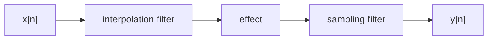
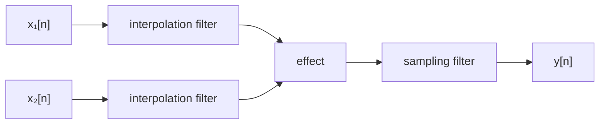

import Image from "../../src/OptimizedImage";
import clipper_img from "../../src/images/app-notes/5/clipper.png";
import x_img from "../../src/images/app-notes/5/x.png";
import naive_y_img from "../../src/images/app-notes/5/naive_y.png";
import lin_kernel_img from "../../src/images/app-notes/5/lin_kernel.png";
import u_img from "../../src/images/app-notes/5/u.png";
import v_img from "../../src/images/app-notes/5/v.png";
import box_kernel_img from "../../src/images/app-notes/5/box_kernel.png";
import y_img from "../../src/images/app-notes/5/y.png";
import clipper_antiderivative_img from "../../src/images/app-notes/5/clipper_antiderivative.png";
import y_calc_img from "../../src/images/app-notes/5/y_calc.png";
import u_ring_img from "../../src/images/app-notes/5/u_ring.png";
import v_ring_img from "../../src/images/app-notes/5/v_ring.png";
import y_ring_img from "../../src/images/app-notes/5/y_ring.png";
import spectrum_comparison_img from "../../src/images/app-notes/5/spectrum_comparison.png";

# App Note 5: Continuous-time Convolution Anti-aliasing for Ring Modulation

Continuous-time convolution anti-aliasing, sometimes known as antiderivative anti-aliasing (ADAA), is a technique for anti-aliasing digital audio effects. It was first introduced as a method for anti-aliasing static nonlinear waveshapers in a 2016 paper by Julian Parker, Vadim Zavalishin and Efflam Le Bivic [[1](#references1)]. Since then, the technique has been extended to a number of other applications in digital audio, including stateful systems [[2](#references2)] and even recurrent neural networks [[3](#references3)].

In this app note, we'll explore using continuous-time convolution anti-aliasing on a ring modulation effect.

## Background

In order to anti-alias an effect with this technique, we must first consider the _continuous_ version of an effect. Then, we create a digital effect by:

1.  Applying a continuous-time low-pass filter (the _reconstruction_ or _interpolation_ filter)
2.  Applying the continuous version of our effect
3.  Applying a continuous-time low-pass filter (the _sampling_ filter)
4.  Sampling the continuous signal



The combination of all these steps is a discrete-time effect, since both the input and output are discrete-time signals. Of course, we'll design each step carefully to ensure that the final result is realizable and tractable.

## A worked example - anti-aliasing a waveshaper

Let's walk through using the technique to anti-alias a simple static waveshaper. This was the original application in [[1](#references1)], and is a simple application that will let us get comfortable with the important concepts.

### The continuous-time effect

First, we define our continuous-time effect. Since this is a static waveshaper, we say $y(t) = f(x(t))$, where $x(t)$ is the input signal and $y(t)$ is the output signal, and $f$ is some function.

In plots, we'll use a simple clipper function as our $f$, but we'll keep the math generic throughout.

<Image src={clipper_img} alt="clipper" />

### Naive discrete-time effect

If we weren't concerned about aliasing, we could apply the continuous-time effect to our discrete-time input signal, then sample to get back to a discrete-time signal. We can think of this process as converting our discrete input signal to a pulse train, applying the continuous-time effect, and then sampling the result. That is, we define

$$
x(t) = \sum_{n=-\infty}^{\infty} x[n] \delta(t - n)
$$

Where $\delta(t)$ is the Dirac delta centered around $0$ (normalized such that $\int_{-\infty}^{\infty}\! d\tau\, \delta(\tau) = 1$). Note that we'll use the convention that samples occur at integers, that is, the sampling period is $1$. This will make the expressions below a bit more concise. We can think of this as a unit convention, where we consider the units of continuous-time to be sampling periods.

<Image src={x_img} alt="x(t)" />

Then we apply the continuous-time effect:

$$
y(t) = f(x(t))
$$

<Image src={naive_y_img} alt="y(t)" />

Finally, we sample the result at $t = n$ to get our discrete-time output signal:

$$
y[n] = y(n) = f(x(n)) = f(x[n])
$$

This is obviously the same result as if we had considered a _discrete-time_ waveshaper -- but, as we'll see in the next section, the conceptual shift to continuous-time is important.

### Continuous-time convolution

To apply the continuous-time convolution technique, we improve on the naive approach by adding two continuous-time filters - an _interpolation_ filter and a _sampling_ filter. This will reduce the aliasing introduced by the sampling step of the naive approach, where we sampled a non-bandlimited signal.

We'll introduce some notation here that we will use throughout the rest of the note.

- $x[n]$: the discrete-time input signal
- $x(t)$: the continuous-time input signal, defined as $x(t) = \sum_{n=-\infty}^{\infty} x[n] \delta(t - n)$
- $u(t)$: $x(t)$ with an interpolation filter $h_i$ applied, to be defined below.
- $v(t)$: $u(t)$ with the continuous-time effect applied
- $y(t)$: $v(t)$ with a sampling filter $h_s$ applied, to be defined below.
- $y[n]$: $y(n)$, that is, a sampled version of $y(t)$.

In the naive version above, since we did not apply either filter, $u(t) = x(t)$ and $y(t) = v(t)$. The remaining work for this example is to choose real filters and calculate $u(t)$, $v(t)$, and $y(t)$.

We are somewhat restricted in the choice of filters, because we need the end-to-end system to be tractable. A common choice in the literature which works well in practice is to use [Lagrange polynomials](https://en.wikipedia.org/wiki/Lagrange_polynomial) as filter kernels for both filters.

We'll use a linear interpolation kernel for the interpolation filter, and a zero-order hold kernel of length $1$ for the sampling filter. Both of these can be considered to be Lagrange polynomials (of order 1 and 0 respectively).

### Interpolation filter

We'll use the standard linear interpolation kernel (also the 1st order Lagrange polynomial) as our kernel.

```math
h_i(t) = \begin{cases}
t + 1 & \text{if } t \in \left[-1, 0\right) \\
1 - t & \text{if } t \in \left[0, 1\right] \\
0 & \text{otherwise}
\end{cases}
```

<Image src={lin_kernel_img} alt="h_i(t)" />

To apply this filter, we convolve the naive input signal $x(t)$ with $h_i(t)$.

$$
u(t) = h_i(t) * x(t)
$$

using the definition of convolution,

$$
u(t) = \int_{-\infty}^{\infty}\! d\tau\, x(t - \tau) h_i(\tau)
$$

using our expression for $x(t)$,

$$
u(t) = \sum_{n=-\infty}^{\infty} x[n] \int_{-\infty}^{\infty}\! d\tau\, \delta(t - n - \tau) h_i(\tau)
$$

doing the integral,

$$
u(t) = \sum_{n=-\infty}^{\infty} x[n] h_i(t - n)
$$

<Image src={u_img} alt="u(t)" />

We note that this is simply a linear interpolation, so for $t \in [(n - 1), n]$,

$$
u(t) = (n - t)x[n - 1] + (t - (n-1))x[n]
$$

### Effect

We apply the effect to this continuous signal as before,

$$
v(t) = f(u(t)) = f\left((n - t)x[n - 1] + (t - (n-1))x[n]\right)
$$

assuming $t \in [(n-1), n]$.

<Image src={v_img} alt="v(t)" />

### Sampling filter

Now, we apply a sampling filter to $v(t)$. Here we use a zero-order hold kernel, centered around $\frac{1}{2}$. Shifting this away from $0$ is a trick that will make the end-to-end system realizable - if we instead centered the filter at $0$, our discrete-time system would end up having to sample $x(t)$ _between_ our original discrete-time samples.

```math
h_s(t) = \begin{cases}
1 & \text{if } t \in \left[0, 1\right] \\
0 & \text{otherwise}
\end{cases}
```

<Image src={box_kernel_img} alt="h_s(t)" />

To compute this analytically, we first use the definition of convolution:

$$
y(t) = (h_s * v)(t) = \int_{-\infty}^{\infty}\! d\tau\, v(t - \tau) h_s(\tau)
$$

Using our expression for $h_s(t)$, this simplifies to

$$
y(t) = \int_{0}^{1}\! d\tau\, v(t - \tau)
$$

<Image src={y_img} alt="y(t)" />

While it won't be important in this note, it's interesting to notice that shifting the filter to be centered at $\frac{1}{2}$ introduces a _system delay_ - that is, $y(t)$ is slightly shifted compared to $v(t)$. This effect is clearly visible in the plot above.

### Sampling

Finally, we can sample the result to create a discrete-time system.

$$
y[n] = y(n) = \int_{0}^{1}\! d\tau\, v(n - \tau)
$$

Substituting our expression for $v(t)$,

$$
y[n] = \int_{0}^{1}\! d\tau\, f\left(\tau x[n - 1] + (1- \tau)x[n]\right)
$$

Grouping terms of $\tau$,

$$
y[n] = \int_{0}^{1}\! d\tau\, f\left((x[n-1] - x[n])\tau + x[n]\right)
$$

Now, consider some function $F$ such that $\frac{d}{dx}F(x) = f(x)$. For the example clipper we've been using in plots, one possible function would be

```math
F(x) = \begin{cases}
\frac{-4x- 1}{8} & \text{if } x < -0.5 \\
\frac{4x - 1}{8} & \text{if } x \ge 0.5 \\
\frac{x^2}{2} & \text{otherwise}
\end{cases}
```

<Image src={clipper_antiderivative_img} alt="F(x)" />

Using the chain rule for derivatives, we see that the derivative of $\frac{F((x[n-1] - x[n])\tau + x[n])}{x[n-1] - x[n]}$ with respect to $\tau$ is $f\left((x[n-1] - x[n])\tau + x[n]\right)$. Thus by the fundamental theorem of calculus,

$$
y[n] = \frac{F(x[n-1]) - F(x[n])}{x[n-1] - x[n]}
$$

Or, rearranging,

$$
y[n] = \frac{F(x[n]) - F(x[n-1])}{x[n] - x[n-1]}
$$

We've successfully collapsed our continuous system, with an interpolation filter, effect, and sampling filter, into a relatively simple discrete-time system. This indeed does achieve some level of anti-aliasing, as explored in [[1](#references1), [4](#references4)]. We now also can see why this technique is sometimes called "antiderivative anti-aliasing" - when we use a zero-order hold filter on a static nonlinear waveshaper, the antiderivative of the waveshaping function shows up in the anti-aliased expression.

<Image src={y_calc_img} alt="yn" />

It's worth noting that this expression becomes ill-defined when $x[n] = x[n-1]$. However, in this case our expression above for $y[n]$ simplifies to $f(x[n])$.

## Ring modulation

Ring modulation is a common effect in synthesizers, often used to create complex waveforms from two simple oscillators. The key idea is that the two oscillators are _multiplied_ together. This effect is called "ring" modulation because of the traditional way to create the effect with analog circuitry (which involves a ring of diodes). For tips on modeling the diode implementation, see Julian Parker's paper from DAFx 2011 [[5](#references5)]. Apart from the diode-based implementation, there are several ways to implement something like a multiplier with analog circuitry, including using a simple VCA (the subject of our own [App Note 4](./4-roland-single-transistor-vca)), as in the JX-8P.

In this app note, however, we'll focus on the simplest way to implement a ring modulation digitally - a pointwise multiplication of two signals!

We'll follow the same continuous-time convolution framework as before, but this time our effect will have two inputs. The scheme will be to first apply interpolation filters to the two inputs separately, apply the continuous-time effect (here it will take two continuous-time signals as inputs and produce one continuous-time signal as an output), and then apply a sampling filter to the result.



### Interpolation filters

We'll use the same interpolation filters as before, i.e., the linear interpolation kernel. Given $t \in [n-1, n]$,

$$
u_1(t) = (n - t)x_1[n - 1] + (t - (n-1))x_1[n]
$$

$$
u_2(t) = (n - t)x_2[n - 1] + (t - (n-1))x_2[n]
$$

As a running example in plots, we'll apply the effect to a sine wave and a band-limited sawtooth wave.

<Image src={u_ring_img} alt="u1" />

### Continuous-time effect

For our ring modulation, our effect will just be a pointwise multiplication of the two input signals:

$$
v(t) = u_1(t) u_2(t)
$$

<Image src={v_ring_img} alt="v" />

expanding with the assumption $t \in [(n-1), n]$,

```math
\begin{aligned}
v(t) &= \bigg[ (n - t)^2 x_1[n - 1] x_2[n - 1] \\
&\phantom{= \bigg[} + \big(n - t\big)\big(t - (n-1)\big)\big(x_1[n]x_2[n-1] + x_1[n-1]x_2[n]\big) \\
&\phantom{= \bigg[} + \big(t - (n-1)\big)^2 x_1[n] x_2[n] \bigg]
\end{aligned}
```

### Sampling filter

Just like before, we'll use a zero-order hold kernel for the sampling filter.

```math
h_s(t) = \begin{cases}
1 & \text{if } t \in \left[0, 1\right] \\
0 & \text{otherwise}
\end{cases}
```

So,

$$
y(t) = (h_s * v)(t)
$$

<Image src={y_ring_img} alt="y" />

The convolution and sampling go through very similarly to the example above,

```math
\begin{aligned}
y[n] &= \int_{0}^{1}\! d\tau\, \bigg[\tau^2 x_1[n - 1] x_2[n - 1] \\
&\phantom{= \int_{0}^{1}\! d\tau\, \bigg[}+ \tau(1 - \tau)(x_1[n]x_2[n-1] + x_1[n-1]x_2[n]) \\
&\phantom{= \int_{0}^{1}\! d\tau\, \bigg[}+ (1 - \tau)^2 x_1[n] x_2[n] \bigg]
\end{aligned}
```

grouping terms of $\tau$,

```math
\begin{aligned}
y[n] &= \int_{0}^{1}\! d\tau\, \bigg[\tau^2 (x_1[n - 1] x_2[n - 1] - x_1[n]x_2[n-1] - x_1[n-1]x_2[n] + x_1[n]x_2[n]) \\
&\phantom{= \int_{0}^{1}\! d\tau\, \bigg[}+ \tau(x_1[n]x_2[n-1] + x_1[n-1]x_2[n] - 2x_1[n] x_2[n]) \\
&\phantom{= \int_{0}^{1}\! d\tau\, \bigg[}+ x_1[n]x_2[n] \bigg]
\end{aligned}
```

integrating with the power rule,

```math
\begin{aligned}
y[n] &= \frac{1}{3} \big(x_1[n - 1] x_2[n - 1] - x_1[n]x_2[n-1] - x_1[n-1]x_2[n] + x_1[n]x_2[n] \big) \\
&\phantom{=}+ \frac{1}{2}\big(x_1[n]x_2[n-1] + x_1[n-1]x_2[n] - 2x_1[n] x_2[n]\big) \\
&\phantom{=}+ x_1[n]x_2[n]
\end{aligned}
```

### Main result

Simplifying,

```math
\begin{aligned}
y[n] &= \frac{1}{3} \big(x_1[n - 1] x_2[n - 1] + x_1[n]x_2[n] \big) \\
&\phantom{=}+ \frac{1}{6}\big(x_1[n]x_2[n-1] + x_1[n-1]x_2[n]\big) \\
\end{aligned}
```

This is a pretty concise little expression! We can see this is similar to a simple two-sample averaging filter, but with additional "cross-terms" $x_1[n]x_2[n-1]$ and $x_1[n-1]x_2[n]$ mixed in.

While a full analysis of the effectiveness of this anti-aliasing scheme is out of scope for this note, we'll quickly compare the spectrum of our test signals under:

- $y_{\text{ideal}}$ - a heavily oversampled implementation, representing something close to the ideal spectrum
- $y_{\text{naive}}$ - the naive discrete-time implementation
- $y_{\text{antialias}}$ - the continuous-time convolution anti-aliasing implementation

<Image src={spectrum_comparison_img} alt="comparison" />

For this choice of input signals, there is a single clear aliased harmonic (which doesn't exist in $y_{\text{ideal}}$). We see that indeed, $y_{\text{antialias}}$ suppresses this aliased harmonic, while largely preserving the other desired harmonics. Some desired high‑frequency harmonics are attenuated by the non‑ideal interpolation and sampling filters.

### Higher-order sampling kernel

If we want slightly better anti-aliasing, we can apply the linear kernel as the sampling filter (instead of the zero-order hold kernel), that is, we can set

```math
h_s(t) = \begin{cases}
t + 1 & \text{if } t \in \left[-1, 0\right) \\
1 - t & \text{if } t \in \left[0, 1\right] \\
0 & \text{otherwise}
\end{cases}
```

then our expression for $y(t)$ becomes

$$
y(t) = \int_{0}^{1}\! d\tau\, \big[(1 - \tau) v(t - \tau) + \tau v(t - \tau + 1)\big]
$$

using a computer algebra system (see [Appendix 2](#appendix-2-code-for-calculating-higher-order-kernel)), we can compute this integral at $t = n$ to get $y[n]$, a discrete-time expression.

```math
\begin{aligned}
y[n] &= \frac{1}{12} \bigg[ x_1[n - 1]x_2[n - 1] + x_1[n-1]x_2[n] \\
&\phantom{= \frac{1}{12} \bigg[} + x_1[n]x_2[n-1] + x_1[n]x_2[n+1] \\
&\phantom{= \frac{1}{12} \bigg[} + x_1[n+1]x_2[n] + x_1[n+1]x_2[n+1]\bigg] \\
&\phantom{=} + \frac{1}{2} x_1[n]x_2[n]
\end{aligned}
```

This should slightly improve anti-aliasing performance, but requires calculating a lot more cross-terms.

### Adding a nonlinearity

We can also consider the case where the ring modulation includes a nonlinearity in one of the terms. For example, in our simplified model of the [transistor VCA ring modulator](./4-roland-single-transistor-vca), we had a continuous-time expression like $v(t) = u_1(t) (e^{u_2(t)} - 1)$. Let's consider a more general nonlinearity of $v(t) = u_1(t) f(u_2(t))$, where $f$ is some nonlinear function and $F_1$ is some function such that $\frac{d}{dx}F_1 = f$, and $F_2$ is some function such that $\frac{d}{dx}F_2 = F_1$.

Using a linear interpolation filter and a zero-order hold sampling filter, our expression for $y[n]$ becomes

$$
y[n] = \int_{0}^{1}\! d\tau\, (\tau x_1[n - 1] + (1 - \tau) x_1[n]) f(\tau x_2[n-1] + (1 - \tau) x_2[n])
$$

grouping terms of $\tau$,

$$
y[n] = \int_{0}^{1}\! d\tau\, ((x_1[n - 1] - x_1[n])\tau + x_1[n]) f \big((x_2[n-1] - x_2[n])\tau + x_2[n]\big)
$$

We have to proceed by integration by parts. We recall first from our work on the static nonlinear case that

$$
\frac{d}{d \tau} \frac{F_1\big((x_2[n-1] - x_2[n])\tau + x_2[n]\big)}{x_2[n-1] - x_2[n]} = f \big((x_2[n-1] - x_2[n])\tau + x_2[n]\big)
$$

Applying integration by parts,

```math
\begin{aligned}
y[n] &= \frac{1}{{x_2[n-1] - x_2[n]}} \bigg[x_1[n - 1]F_1(x_2[n - 1]) - x_1[n]F_1(x_2[n]) \\
&\phantom{= \frac{1}{{x_2[n-1] - x_2[n]}} \bigg[} - (x_1[n - 1] - x_1[n])\int_{0}^{1}\! d\tau\, F_1 \big((x_2[n-1] - x_2[n])\tau + x_2[n]\big) \bigg]
\end{aligned}
```

The remaining integral is the exact same form as the one we solved to anti-alias the static waveshaper, so we recall the result is $\frac{F_2(x_2[n-1]) - F_2(x_2[n])}{x_2[n-1] - x_2[n]}$. Putting this all together and rearranging,

```math
\begin{aligned}
y[n] &= \frac{1}{{x_2[n] - x_2[n-1]}} \bigg[x_1[n]F_1(x_2[n]) - x_1[n - 1]F_1(x_2[n - 1]) \\
&\phantom{= \frac{1}{{x_2[n] - x_2[n-1]}} \bigg[} - (x_1[n] - x_1[n - 1])\frac{F_2(x_2[n]) - F_2(x_2[n-1])}{x_2[n] - x_2[n-1]} \bigg]
\end{aligned}
```

We can check this result by computing $y(t)$ for $f(x) = x$ (implying $F_1(x) = \frac{x^2}{2}$ and $F_2(x) = \frac{x^3}{6}$). Using a computer algebra system shows that the expression simplifies to our main result $y[n] = \frac{1}{3} \big(x_1[n - 1] x_2[n - 1] + x_1[n]x_2[n] \big) + \frac{1}{6}\big(x_1[n]x_2[n-1] + x_1[n-1]x_2[n]\big)$ (see [Appendix 3](#appendix-3-code-for-checking-nonlinear-ring-mod-expression)).

## References

1. <span id="references1">
     ["Reducing the Aliasing of Nonlinear Waveshaping Using Continuous-Time
     Convolution" by Julian D. Parker, Vadim Zavalishin, Efflam Le
     Bivic](https://dafx.de/paper-archive/2016/dafxpapers/20-DAFx-16_paper_41-PN.pdf)
     (DAFx 2016)
   </span>
2. <span id="references2">
     ["Antiderivative anti-aliasing for stateful digital effects" by Martin
     Holters](https://www.hsu-hh.de/ant/wp-content/uploads/sites/699/2020/10/DAFx2019_paper_4.pdf)
     (DAFx 2019)
   </span>
3. <span id="references3">
     ["Antiderivative anti-aliasing for recurrent neural networks" by Otto
     Mikkonen and Kurt James
     Werner](https://dafx.de/paper-archive/2025/DAFx25_paper_72.pdf) (DAFx 2025)
   </span>
4. <span id="references4">
     ["Practical Considerations for Antiderivative Anti-Aliasing" by Jatin
     Chowdhury](https://ccrma.stanford.edu/~jatin/Notebooks/adaa.html)
     (Published on personal CCRMA website)
   </span>
5. <span id="references5">
     ["A Simple Digital Model of the Diode-based Ring-modulator" by Julian
     Parker](http://recherche.ircam.fr/pub/dafx11/Papers/66_e.pdf) (DAFx 2011)
   </span>

## Appendix 1: Code for figures

Apologies for the mess!

```julia
import Pkg
Pkg.activate(".")
Pkg.add("Plots")
Pkg.add("Interpolations")
Pkg.add("Symbolics")
Pkg.add("DSP")
Pkg.add("LaTeXStrings")
Pkg.add("FFTW")
Pkg.add("Peaks")
using Plots
using Interpolations
using DSP
using Printf
using Symbolics
using LaTeXStrings
using FFTW
using Peaks
theme(:dracula)

@variables x y

signal = sin.(2π .* range(0, 2.2, length=25))
sampled_t = 0:length(signal)-1
p = plot(sampled_t, signal, seriestype=:stem, marker=:circle, label=L"x(t)")
hline!(p, [0], label="", color=1)
savefig(p, "x.png")

clip(x) = ifelse(x < -0.5, -0.5, ifelse(x > 0.5, 0.5, x))
p = plot(clip, label=L"f(x)", ylims=(-1, 1), xlims=(-1, 1), color=2)
savefig(p, "clipper.png")

naive_output = clip.(signal)
p = plot(sampled_t, signal, seriestype=:stem, marker=:circle, label=L"x(t)")
hline!(p, [0], label="", color=1)
plot!(p, sampled_t, naive_output, seriestype=:stem, marker=:circle, label=L"y(t)", color=2)
savefig(p, "naive_y.png")

oversampling_ratio = 10000
continuous_t = range(0, step=1/oversampling_ratio, length=oversampling_ratio * (length(signal)-1) + 1)
continuous_signal = linear_interpolation(0:length(signal)-1, signal).(continuous_t)
p   = plot(sampled_t, signal, seriestype=:stem, marker=:circle, label=L"x(t)")
hline!(p, [0], label="", color=1)
plot!(p, continuous_t, continuous_signal, label=L"u(t)", color=3)
savefig(p, "u.png")

clipped_continuous_signal = clip.(continuous_signal)
p = plot(sampled_t, signal, seriestype=:stem, marker=:circle, label=L"x(t)")
hline!(p, [0], label="", color=1)
plot!(p, continuous_t, continuous_signal, label=L"u(t)", color=3)
plot!(p, continuous_t, clipped_continuous_signal, label=L"v(t)", color=4)
savefig(p, "v.png")

filter_length = oversampling_ratio
box_filter = fill(1.0 / filter_length, filter_length)
filtered_clipped_continuous_signal = DSP.conv(clipped_continuous_signal, box_filter)[1:length(clipped_continuous_signal)]

sampled_filtered_clipped_continuous_signal = filtered_clipped_continuous_signal[1:oversampling_ratio:oversampling_ratio*(length(signal)-1)+1]

p = plot(sampled_t, signal, seriestype=:stem, marker=:circle, label=L"x(t)")
hline!(p, [0], label="", color=1)
plot!(p, continuous_t, continuous_signal, label=L"u(t)", color=3)
plot!(p, continuous_t, clipped_continuous_signal, label=L"v(t)", color=4)
plot!(p, continuous_t, filtered_clipped_continuous_signal, label=L"y(t)", color=5)
savefig(p, "y.png")


lin_kernel = ifelse(x < -1, 0, ifelse(x <= 0, (x + 1), ifelse(x <= 1, (1 - x) , 0)))
p = plot(lin_kernel, xlims=(-2, 2), label=L"h_i(t)", color=3)
savefig(p, "lin_kernel.png")

box_kernel = ifelse(x < 0, 0, ifelse(x <= 1, 1, 0))
p = plot(box_kernel, xlims=(-2, 2), label=L"h_s(t)", color=5)
savefig(p, "box_kernel.png")

clipper_antiderivative(z) = ifelse(z < -0.5, -0.5 * z - 0.125, ifelse(z <= 0.5, 0.5 * z ^ 2, 0.5 * z - 0.125))
p = plot(clipper_antiderivative(x), xlims=(-1, 1), label=L"F(x)", color=2)
savefig(p, "clipper_antiderivative.png")

shifted_signal = [0; signal[1:end-1]]
y_calc = (clipper_antiderivative.(signal) .- clipper_antiderivative.(shifted_signal)) ./ (signal .- shifted_signal)
p = plot(sampled_t, signal, seriestype=:stem, marker=:circle, label=L"x(t)")
hline!(p, [0], label="", color=1)
plot!(p, continuous_t, continuous_signal, label=L"u(t)", color=3)
plot!(p, continuous_t, clipped_continuous_signal, label=L"v(t)", color=4)
plot!(p, continuous_t, filtered_clipped_continuous_signal, label=L"y(t)", color=5)
plot!(p, sampled_t, y_calc, seriestype=:stem, marker=:circle, label=L"y[n]", color=2)
savefig(p, "y_calc.png")

# calculate a band-limited saw by summing harmonics
function bl_saw(cycles, limit_length, real_length)
    phase_offset = 0.3
    t = range(0, 1, length=real_length)
    base_rate = cycles
    harmonic = 1
    output = zeros(real_length)
    while harmonic * base_rate < limit_length / 2
        output += sin.(2π .* harmonic .* base_rate .* (t .+ phase_offset)) ./ harmonic
        harmonic += 1
    end
    return output
end

signal2 = bl_saw(1.8, 25, 25)
continuous_signal2 = linear_interpolation(0:length(signal2)-1, signal2).(continuous_t)

p = plot(sampled_t, signal, seriestype=:stem, marker=:circle, label=L"x_1(t)")
hline!(p, [0], label="", color=1)
plot!(p, sampled_t, signal2, seriestype=:stem, marker=:circle, label=L"x_2(t)", color=6)
plot!(p, continuous_t, continuous_signal, label=L"u_1(t)", color=3)
plot!(p, continuous_t, continuous_signal2, label=L"u_2(t)", color=7)
savefig(p, "u_ring.png")

v_ring = continuous_signal .* continuous_signal2

p = plot(continuous_t, continuous_signal, label=L"u_1(t)", color=3)
plot!(p, continuous_t, continuous_signal2, label=L"u_2(t)", color=7)
plot!(p, continuous_t, v_ring, label=L"v(t)", color=4)
savefig(p, "v_ring.png")

filtered_v_ring = DSP.conv(v_ring, box_filter)[1:length(v_ring)]

p = plot(continuous_t, v_ring, label=L"v(t)", color=4)
plot!(p, continuous_t, filtered_v_ring, label=L"y(t)", color=5)
savefig(p, "y_ring.png")

l = 4096
ratio = 4096 / 25
cycles1 = 1.9 * ratio
cycles2 = 2.4 * ratio
oversampling = 256
signal1_oversampled = sin.(2π .* range(0, cycles1, length=l*oversampling))
signal2_oversampled = bl_saw(cycles2, l, l*oversampling)
result_oversampled = signal2_oversampled .* signal1_oversampled .* Windows.hann(l*oversampling)

spectrum_oversampled = abs.(rfft(result_oversampled)) ./ (l*oversampling)
freqs_oversampled = rfftfreq(length(result_oversampled), oversampling)
first_index = findfirst(x -> x > 0.5, freqs_oversampled)

spectrum_oversampled = spectrum_oversampled[1:first_index]
freqs_oversampled = freqs_oversampled[1:first_index]
peaks_index_oversampled, peaks_value_oversampled = findmaxima(spectrum_oversampled)

signal1 = sin.(2π .* range(0, cycles1, length=l))
signal1_shifted = [0; signal1[1:end-1]]
signal2 = bl_saw(cycles2, l, l)
signal2_shifted = [0; signal2[1:end-1]]

result_naive = signal2 .* signal1 .* Windows.hann(l)

spectrum_naive = abs.(rfft(result_naive)) ./ l
freqs_naive = rfftfreq(length(result_naive), 1)
peaks_index_naive, peaks_value_naive = findmaxima(spectrum_naive)

result_anti_alias = (1/3 .* (signal1 .* signal2) .+
                       1/3 .* (signal1_shifted .* signal2_shifted) .+
                       1/6 .* (signal1 .* signal2_shifted) .+
                       1/6 .* (signal2 .* signal1_shifted)) .* Windows.hann(l)

spectrum_anti_alias = abs.(rfft(result_anti_alias)) ./ l
freqs_anti_alias = rfftfreq(length(result_anti_alias), 1)
peaks_index_anti_alias, peaks_value_anti_alias = findmaxima(spectrum_anti_alias)

p = plot(freqs_oversampled, 20*log10.(spectrum_oversampled .+ eps()),
     xlabel="Frequency (cycles/sample)", ylabel="Magnitude (dB)", label="", legend=:bottomleft, ylims=(-70, -10), color=1)
plot!(p, freqs_oversampled[peaks_index_oversampled], 20*log10.(peaks_value_oversampled .+ eps()), seriestype=:scatter, marker=:xcross, label=L"y_{ideal}(t)", markersize=8, color=1)
plot!(p, freqs_naive, 20*log10.(spectrum_naive .+ eps()), label="", color=2)
plot!(p, freqs_naive[peaks_index_naive], 20*log10.(peaks_value_naive .+ eps()), seriestype=:scatter, label=L"y_{naive}(t)",  marker=:xcross, color=2)
plot!(p, freqs_anti_alias, 20*log10.(spectrum_anti_alias .+ eps()), label="", color=5)
plot!(p, freqs_anti_alias[peaks_index_anti_alias], 20*log10.(peaks_value_anti_alias .+ eps()), seriestype=:scatter, label=L"y_{antialias}(t)", color=5, marker=:xcross)
savefig(p, "spectrum_comparison.png")
```

## Appendix 2: Code for calculating higher-order kernel

```julia
import Pkg
Pkg.activate(".")
Pkg.add("Symbolics")
using Symbolics

x1a, x2a, x1b, x2b, x1c, x2c, tau = @variables var"x_1[n-1]", var"x_2[n-1]", var"x_1[n]", var"x_2[n]", var"x_1[n+1]", var"x_2[n+1]", var"τ"

v1 = tau ^ 2 * (x1a * x2a) + tau * (1 - tau) * (x1a * x2b + x1b * x2a) + (1 - tau) ^ 2 * (x1b * x2b)
v2 = tau ^ 2 * (x1b * x2b) + tau * (1 - tau) * (x1b * x2c + x1c * x2b) + (1 - tau) ^ 2 * (x1c * x2c)
v = (1 - tau) * v1 + tau * v2

# collect terms by powers of tau
expanded_v = expand(v)
max_degree = Symbolics.degree(expanded_v, tau)

collected_expr = substitute(expanded_v, tau => 0)
for i in 1:max_degree
    coeff_val = Symbolics.coeff(expanded_v, tau^i)
    # apply power rule to integrate
    collected_expr += coeff_val / (i + 1)
end

display("text/plain", expand(collected_expr))
```

## Appendix 3: Code for checking nonlinear ring modulation expression

```julia
import Pkg
Pkg.activate(".")
Pkg.add("Symbolics")
using Symbolics

x1a, x2a, x1b, x2b = @variables var"x_1[n-1]", var"x_2[n-1]", var"x_1[n]", var"x_2[n]"

f1(x) = 1 / 2 * x ^ 2
f2(x) = 1 / 6 * x ^ 3

y = 1 / (x2b - x2a) * (x1b * f1(x2b) - x1a * f1(x2a) - (x1b - x1a)/(x2b - x2a) * (f2(x2b) - f2(x2a)))
display(simplify(y))
```
