import { Callout } from "nextra/components";
import Image from "next/image";

# Building your first plug-in with Conformal

Welcome to Conformal! In this tutorial we'll:

- Set up our development environment
- Build a simple tremolo effect plug-in using Conformal

If you need help or encounter any issues along the way, please use the "Questions?" link on the right sidebar to start a discussion on GitHub, we'd love to hear from you!

<Callout type="warning">
  Note that this tutorial will only work on a macOS system.
</Callout>

## What are we building?

In this tutorial we'll build a plug-in that applies an artificial [tremolo](https://en.wikipedia.org/wiki/Tremolo) effect to an audio signal. This effect is simple to implement (which is why it was chosen!), but it can be musically useful. Many classic guitar amplifiers can apply this effect, which confusingly was often labeled "vibrato".

## Installing prerequisites

The first step is to install [homebrew](https://brew.sh), which is a package manager that we'll use to install the other tools we need to build Conformal projects. To install brew, follow the instructions on [their website](https://brew.sh).

Next up, we need to install [bun](https://bun.sh), which is the toolkit we use to run TypeScript code. Conformal uses TypeScript for scripts for common tasks like building and testing, so you'll be using `bun` a lot! However, you don't need to become a `bun` expert to work with Conformal - feel free to treat it as a black-box.

To install `bun`, we can use `brew`:

```sh copy
brew install bun
```

Next, we'll install VST3 SDK. This can live anywhere that's convenient for you - if you're not sure where to put it, why not in `~/SDKs`?

```sh copy
mkdir -p ~/SDKs && git clone https://github.com/steinbergmedia/vst3sdk.git ~/SDKs/vst3sdk --branch v3.7.8_build_34 --recurse-submodules
```

## Create a new project

Now that we have all the tools we need, let's create a new Conformal project! To do this, we'll use the `bun create` command, the syntax is `bun create conformal <project_slug>`. Here a ["slug"](https://stackoverflow.com/a/4230937/930949) is the internal name for the project, which must be in `lower_snake` case and in particular must _not_ contain spaces. Note that a _project_ can contain multiple _plug-ins_. You can use whatever slug you like; but in the commands in this tutorial we'll use `conformal_tutorial`.

```sh copy
bun create conformal conformal_tutorial
```

This script will ask you a few questions to set up your project. The first question it will ask you is the "slug" for the plug-in, which again should be `lower_snake` case and not contain spaces. Since we're making a tremolo plug-in, `tremolo` makes sense.

After that, it will ask about a human-readable "vendor" name. Most DAWs group plug-ins by vendor. You can choose anything you like here, but "Conformal Tutorial" works if you can't think of anything

Finally, it will ask you for a human-readable plug-in name. Let's call it "Tremolo".

```
? Plug-in slug (lower snake_case, e.g. `my_plugin`) tremolo
? Human-readable vendor name (DAWs often present plug-ins grouped by vendor).  e.g., "My Project"?
Conformal Tutorial
? Human-readable plug-in name (e.g. `My Plug-in`)? Tremolo
```

At this point, you're the proud owner of a new Conformal project in the `conformal_tutorial` directory! 🎉. Let's take a quick tour!

### The project structure

- `rust` - This include the signal processing code. In a new project, this will contain two crates:
  - `tremolo/component` - This contains the core processing code.
  - `tremolo/vst` - This wraps the `tremolo/component` crate in a format compatible with the VST3 SDK. You hopefully won't have to change this crate much.
- `web` - In a new project, this will contain a few configuration packages, but only one really important package:
  - `tremolo` - This contains the user interface for the `tremolo` plug-in.

There's some other files in the repo, which are there to configure various tools used for build-related tasks. If you aren't familiar with them, don't worry - Conformal aims to provide a good starting point. If you are familiar with them, though, you should feel free to customize them!

## Development environment

Now that we have our project folder, we need to tell the project where to find the VST3 SDK you installed earlier. We do this by setting the `VST3_SDK_DIR` environment variable in a `.env` file.

From here on out, run all shell commands from the project folder (`cd conformal_tutorial` should get you there!)

```sh copy
echo "VST3_SDK_DIR=$HOME/SDKs/vst3sdk" > .env
```

Now, we can install all the project's TypeScript dependencies with

```sh copy
bun install
```

We can use the project's `bootstrap` script to finish installing the required development tools 🥾.

<Callout type="info">
  `bootstrap` is a one-time set-up - you won't need to run it again, even if you
  set-up a new project!
</Callout>

```sh copy
bun run bootstrap
```

## Building the project

At this point, it's a good idea to make sure the project builds correctly and we can load the plug-in in a DAW. To build the plug-in and package it for use in a DAW, we use the package script:

```sh copy
bun run package
```

Now, the plug-in should be accessible from your VST3-compatible DAW! For example, it should show up like this in Ableton:


Right now, the plug-in will be a simple volume control, with a pretty awkward UI. But, it's a plug-in, and you built it! Congratulations! 🎊 Feel free to take some time to celebrate 🥳.

For the rest of the tutorial, we'll modify this template project to create a tremolo effect.

## Tremolo processing

To implement the audio processing part of the plug-in, we'll have to modify the rust code that defines the processing. This will be in `rust/tremolo/component/src/lib.rs`. Open the file and take a look around!

The most relevant parts of this file are:

- The `PARAMETERS` array, which defines the user-controllable parameters. Right now this includes "Bypass", which is required for VST3 effects, and "Gain", which controls the volume. We'll need to change these to the parameters we want for the tremolo effect.
- The `Effect` struct and trait implementation, which defines the actual processing. Note that right now, the `Effect` struct has no data, which means that the processing is _stateless_ - it doesn't remember anything between calls - something as simple as a volume control doesn't have to!

To create our tremolo effect, we'll first create an [LFO](https://en.wikipedia.org/wiki/Low-frequency_oscillation), which will output a slow signal that will bounce up and down between `0.0` (fully off) and `1.0` (fully on). Then, we'll multiply the input signal by this LFO signal to create the tremolo effect. The signal flow will look like this:

```mermaid
graph LR
    A[Input] --> D[✕]
    C[LFO] --> D
    D --> E[Output]
```



### Writing the LFO

Let's dig in and start writing the LFO! We'll implement this in a new file in the `tremolo/component/src` directory, called `lfo.rs`. This file will define the `Lfo` struct that we'll later use to implement the tremolo effect.

```rust filename="tremolo/component/src/lfo.rs" copy
#[derive(Default, Clone, Debug)]
pub struct Lfo {
    /// State will vary from 0.0 (at the beginning of a cycle
    /// to 1.0 (at the end of a cycle)
    state: f32,
}

impl Lfo {
    /// Here `increment` is the rate the LFO expressed in cycles per sample.
    /// E.g., if this is 0.1, the LFO will complete a cycle every 10 samples.
    ///
    /// We return the current value of the Lfo.
    pub fn run(&mut self, increment: f32) -> f32 {
        // When we are less than half-way through the cycle,
        // the output value goes up as we move through the cycle,
        // when we are more than half-way through, the output value
        // goes down as we move through the cycle.
        //
        // This ends up creating a triangle wave: `/\/\/\/\/\/`
        let value = if self.state < 0.5 {
            self.state * 2.0
        } else {
            2.0 - self.state * 2.0
        };

        // Increment the state by the increment value, wrapping to keep the state
        // between 0.0 and 1.0.
        self.state = (self.state + increment) % 1.0;

        value
    }
}
```

To add this to the project, we'll need to add the following line somewhere in `lib.rs`

```rust filename="tremolo/component/src/lib.rs" copy
mod lfo;
```

Now we have an LFO! 🤘

### Optional: Testing the LFO

Well, we _think_ have the LFO, but how do we know it actually works? We can add some unit tests to the `lfo.rs` file to ensure basic properties are upheld!

<Callout emoji="🏃">
  If you're in a rush, you can skip this section to get on with building the
  rest of the plug-in.
</Callout>

```rust filename="tremolo/component/src/lfo.rs" copy
#[cfg(test)]
mod tests {
    use super::*;

    #[test]
    fn starts_at_zero() {
        let mut lfo = Lfo::default();
        assert_eq!(lfo.run(0.1), 0.0);
    }

    #[test]
    fn completes_in_ten_samples() {
        let mut lfo = Lfo::default();
        for _ in 0..10 {
            lfo.run(0.1);
        }
        assert_eq!(lfo.run(0.1), 0.0);
    }
}
```

We can run all rust tests with the following command:

```sh copy
bun run rust-test
```

Unfortunately, if we run this, we'll get the following error:

```
---- lfo::tests::completes_in_ten_samples stdout ----
thread 'lfo::tests::completes_in_ten_samples' panicked at rust/tremolo/component/src/lfo.rs:50:9:
assertion `left == right` failed
  left: 2.3841858e-7
 right: 0.0
```

Darn, what happened? The answer is that rounding errors accumulated over the 10 sample cycle, so that the LFO didn't return to _exactly_ zero but rather the very small number of `2e-7`. This illustrates a basic principle for testing audio processing:

<Callout emoji="🔊">
  When testing audio processing code, **never** compare floating-point numbers
  exactly. Instead, allow some small amount of difference between the expected
  and actual values to allow for rounding errors.
</Callout>

Luckily, the Rust ecosystem has our backs - there's a crate called `assert_approx_eq` that provides a macro to compare floating-point numbers approximately. We can add this to our `Cargo.toml` file:

```toml filename="tremolo/component/Cargo.toml" copy
[dev-dependencies]
assert_approx_eq = "1.1.0"
```

Note that we put dependencies like that are only used for testing, in the `[dev-dependencies]` section.

<Callout emoji="✏️">
  Exercise: Replace the `assert_eq!` macro with the `assert_approx_eq!` macro
  and get the tests to pass. **Hint**: You'll need to import the macro at the
  top of the `tests` module with `use assert_approx_eq::assert_approx_eq;`.
</Callout>

### Using the LFO

Now, we're in a position to use the LFO in the tremolo effect! Make the following edits to `lib.rs` to hook it up:

```rust filename="tremolo/component/src/lib.rs" copy
#[derive(Clone, Debug, Default)]
pub struct Effect {
    lfo: lfo::Lfo,
}

impl Processor for Effect {
    fn set_processing(&mut self, processing: bool) {
        if processing {
            // Reset the LFO when processing is enabled. This makes sure that
            // the LFO always starts at the beginning of a cycle when processing begins.
            self.lfo = lfo::Lfo::default();
        }
    }
}

// TODO: This number is pulled out of a hat! We should calculate this better.
const LFO_INCREMENT: f32 = 1.0 / 10000.0;

impl EffectTrait for Effect {
    fn handle_parameters<P: parameters::States>(&mut self, _: P) {}
    fn process<P: BufferStates, I: Buffer, O: BufferMut>(
        &mut self,
        parameters: P,
        input: &I,
        output: &mut O,
    ) {
        // Copy our stored LFO into the `lfo` variable.
        // If we run the LFO on multiple channels, we want to always start
        // in the same state.
        let lfo = self.lfo.clone();

        for (input_channel, output_channel) in channels(input).zip(channels_mut(output)) {
            // Copy the `lfo` variable into a new variable for each channel.
            let mut channel_lfo = lfo.clone();
            for ((input_sample, output_sample), (gain, bypass)) in input_channel
                .iter()
                .zip(output_channel.iter_mut())
                .zip(pzip!(parameters[numeric "gain", switch "bypass"]))
            {
                *output_sample = *input_sample
                    * (if bypass {
                        1.0
                    } else {
                        channel_lfo.run(LFO_INCREMENT) * gain / 100.0
                    });
            }
            // Update the stored LFO with the state of the channel LFO.
            self.lfo = channel_lfo;
        }
    }
}
```

Most of the subtle points are called out in comments but here are a few things to keep in mind:

- When writing a processor with _state_, it's important that the state gets _reset_ when processing is enabled. This ensures processing is deterministic so that every time a user runs the plug-in, they get the same result. This should be done in the `set_processing` function.
- Effects sometimes run in multiple channels (e.g., stereo). Sometimes this means we have to do some thinking about how the multiple channels interact with internal state of processing. In this case, we copied the stored state into a new variable for each channel, and then copied the state back into the stored state at the end of the channel loop. This is a simple way to make sure that the state progresses the same way in each channel, but of course there are many ways to accomplish this.

At this point, you can use `bun run package` again to test out the tremolo effect in this nascent state 🐣.

### Sampling rates

One flaw with the effect as it stands now is that we're using a fixed increment for the LFO, which means that the LFO will complete a cycle every 10,000 samples. However, what we hear is how often the LFO completes a cycle in _seconds_. The conversion rate between samples and seconds is controlled by the DAW, and in most DAWs the user can set it to whatever they want! So, as a plug-in, we need to work with whatever sampling rate we are provided with. We can accomplish this by adding a `sampling_rate` field to the `Effect` struct, and updating the LFO increment based on the sampling rate.

```rust {3,38,53-58} filename="tremolo/component/src/lib.rs" copy
#[derive(Clone, Debug)]
pub struct Effect {
    sampling_rate: f32,
    lfo: lfo::Lfo,
}

impl Processor for Effect {
    fn set_processing(&mut self, processing: bool) {
        if processing {
            self.lfo = lfo::Lfo::default();
        }
    }
}

const LFO_RATE: f32 = 5.0;

impl EffectTrait for Effect {
    fn handle_parameters<P: parameters::States>(&mut self, _: P) {}
    fn process<P: BufferStates, I: Buffer, O: BufferMut>(
        &mut self,
        parameters: P,
        input: &I,
        output: &mut O,
    ) {
        let lfo = self.lfo.clone();

        for (input_channel, output_channel) in channels(input).zip(channels_mut(output)) {
            let mut channel_lfo = lfo.clone();
            for ((input_sample, output_sample), (gain, bypass)) in input_channel
                .iter()
                .zip(output_channel.iter_mut())
                .zip(pzip!(parameters[numeric "gain", switch "bypass"]))
            {
                *output_sample = *input_sample
                    * (if bypass {
                        1.0
                    } else {
                        channel_lfo.run(LFO_RATE / self.sampling_rate) * gain / 100.0
                    });
            }
            self.lfo = channel_lfo;
        }
    }
}

impl ComponentTrait for Component {
    type Processor = Effect;

    fn parameter_infos(&self) -> Vec<parameters::Info> {
        parameters::to_infos(&PARAMETERS)
    }

    fn create_processor(&self, env: &ProcessingEnvironment) -> Self::Processor {
        Effect {
            sampling_rate: env.sampling_rate,
            lfo: lfo::Lfo::default(),
        }
    }
}
```

It's worth taking a breath to think through the units here, since sample rate calculations can often be tricky 🤔: `LFO_RATE` is in units of $\frac{\text{cycles}}{\text{seconds}}$, while `sampling_rate` is in units of $\frac{\text{samples}}{\text{seconds}}$, and the `run` function takes an argument `increment` in units of $\frac{\text{cycles}}{\text{samples}}$. Thinking this through, `LFO_RATE / self.sampling_rate` gives us $\frac{\text{cycles}}{\text{seconds}} \times \frac{\text{seconds}}{\text{samples}} = \frac{\text{cycles}}{\text{samples}}$, the correct units for `increment`.

If you repackage plug-in again with `bun run package`, you should find that the tremolo effect now sounds the same at any sampling rate! 🕰️

### Controlling the tremolo rate

While we have a tremolo effect, right now there is no way for the user to control the rate! Let's add one. To do this, we'll adjust the `PARAMETERS` array to replace the `gain` parameter with a `rate` parameter.

```rust filename="tremolo/component/src/lib.rs" copy
const PARAMETERS: [InfoRef<'static, &'static str>; 2] = [
    InfoRef {
        title: "Bypass",
        short_title: "Bypass",
        unique_id: "bypass",
        flags: Flags { automatable: true },
        type_specific: TypeSpecificInfoRef::Switch { default: false },
    },
    InfoRef {
        title: "Rate",
        short_title: "Rate",
        unique_id: "rate",
        flags: Flags { automatable: true },
        type_specific: TypeSpecificInfoRef::Numeric {
            default: 5.,
            valid_range: 0.01f32..=10.,
            units: "Hz",
        },
    },
];
```

Most of the fields on `InfoRef` should be pretty intuitive! If something is confusing or you want to learn more, you can deep-dive on any field in the Rust API documentation.

Now, we need to: update the `process` function to stop using the `gain` parameter and use this new `rate` parameter instead!

```rust {11,14,20} filename="tremolo/component/src/lib.rs" copy
    fn process<P: BufferStates, I: Buffer, O: BufferMut>(
        &mut self,
        parameters: P,
        input: &I,
        output: &mut O,
    ) {
        let lfo = self.lfo.clone();

        for (input_channel, output_channel) in channels(input).zip(channels_mut(output)) {
            let mut channel_lfo = lfo.clone();
            for ((input_sample, output_sample), (rate, bypass)) in input_channel
                .iter()
                .zip(output_channel.iter_mut())
                .zip(pzip!(parameters[numeric "rate", switch "bypass"]))
            {
                *output_sample = *input_sample
                    * (if bypass {
                        1.0
                    } else {
                        channel_lfo.run(rate / self.sampling_rate)
                    });
            }
            self.lfo = channel_lfo;
        }
    }
```

Finally, we can delete the `LFO_RATE` constant, which is no longer needed.

If you repackage the plug-in with `bun run package`, you should find that the tremolo effect now indeed has a rate control in the DAW automation lane! Nice! this concludes the Rust part of the tutorial, we've accomplished our goal of building a tremolo effect!

However, you may have noticed that we've broken the user interface, which still is expecting the `gain` parameter to be present. Let's fix that now!

## Building the User Interface

Let's dive right in to writing the user interface! In this tutorial we'll move pretty fast in the spirit of having fun and getting results quickly 🚀. We'll try to focus on what's unique to Conformal and not get too bogged down in deep explanations of concepts.

If you are feeling lost or want to learn the concepts properly, it might be worth spending some time doing a tutorial or reading documentation specifically on React development in TypeScript, which should cover the basics of building web UIs in TypeScript in much more depth than this tutorial does.

### Development workflow

After we removed the gain parameter, our UI will be blank due to an error. Let's fix this by deleting the entire contents of `web/tremolo/src/Layout.tsx` and replacing it with this stub:

```tsx filename="web/tremolo/src/Layout.tsx" copy
const Layout = () => <div>Hello, world!</div>;

export default Layout;
```

Running `bun run package` and re-launching our DAW should show something like this:

<Image
  src="/conformal/first-plug-in-imgs/01-stub-ui.png"
  alt="Stub UI"
  width="320"
  height="320"
/>

We can now start building the UI by making changes to `Layout.tsx` and then remembering to call `bun run package` and re-launching our DAW to see the changes. However, there's a _much_ faster way to work on UIs, the Dev Server! To start the dev server, run:

```sh copy
bun run web-dev
```

Then, click the "switch to dev server" button in the bottom-right of the plug-in window.

<Callout type="info">
  Note that users won't be able to see this button, it's only enabled in "dev
  mode". "Dev mode" is automatically turned on for the plug-in when the `bun run
  package` script is called.
</Callout>

Now, while the plug-in is open in the DAW, make an edit to `Layout.tsx` and save the file, for example, change the "Hello, world!" text to womething else! You should see the changes reflected immediately in the plugin window! Pretty cool, huh? 🪄

You can click the "switch to embedded" button to go back to the view that's embedded into the plug-in. This will be way the view was the last time you ran `bun run package`.

### Building interactivity

Music software UIs tend to be _completely wild_. Unlike software that's purely goal-directed, music software should spark the creativity of the user. Because of this, there's tons of room for fun and whimsy in the design space. For visual historical references on the history of music interface design, we can recommend any of the books by [bjooks](https://bjooks.com).

Despite the creative freedom here, in this tutorial, for simplicity, we're going to be super boring 🥱 and use interface elements that are built-in to the web platform. In your own projects, you should feel free to build your own interface elmements or use any React-based library you find on `npm`. Our best friend is going to be the `range`-type `input`, documented [here](https://developer.mozilla.org/en-US/docs/Web/HTML/Element/input/range). To hook up a `range` control to our rate parameter, we can edit the `Layout.tsx` like this:

```tsx filename="web/tremolo/src/Layout.tsx" copy
import { useNumericParam } from "@conformal/plugin";

const Layout = () => {
  const {
    value,
    info: {
      valid_range: [min, max],
    },
    set,
  } = useNumericParam("rate");
  return (
    <div>
      <label>
        Rate: <span style={{ float: "right" }}>{value.toFixed(2)}hz</span>
      </label>
      <div>
        <input
          type="range"
          min={min}
          max={max}
          value={value}
          step="any"
          onChange={(e) => set(parseFloat(e.currentTarget.value))}
          style={{ width: "100%" }}
        />
      </div>
    </div>
  );
};

export default Layout;
```

Here `useNumericParam`, provided by Conformal, acts as a bridge between the plug-in's state and the React component. This is called a React _hook_, and is meant to be called inside a React Component. The hook returns an object containing the parameter's current `value`, relevant `info` like the `min` and `max` value of the parameter, and a `set` function you can call to set the current state.

The rest of the implementation simply hooks up the data returned by `useNumericParam` to an `input` `rante` element, and updates the value when the user moves the slider.

After this, we should be able to move the slider in the UI to control the rate of the tremolo effect! _Functionally_, the tremolo effect is now complete!

### Adding a little color

Okay, we said we were going to be boring, but perhaps we've taken things a little too far with the borigness. It's getting a bit sleepy in here 💤. Let's add a little flair, first by changing the colors and fonts in the UI. In the template project, the style is defined by `index.css`.

As projects get more complicated, you may want to have a more robust styling system than a single CSS file. Your plug-in UI in Conformal is just a React app, so it's compatible with any styling system that works with React, such as [tailwindcss](https://tailwindcss.com/), or [CSS Modules](https://github.com/css-modules/css-modules). For now, let's just dump everything in `index.css`. This specific CSS might look a bit weird, since it's using unusual directives to style `input` elements. There's some documentation [here](https://developer.mozilla.org/en-US/docs/Web/CSS/::-webkit-slider-thumb)

```css filename="web/tremolo/src/index.css" copy
body {
  user-select: none;
  -webkit-user-select: none;
  background: #170f11;
  color: #af2bbf;
  font-family: "Gill Sans";
  font-size: 36px;
}

input[type="range"] {
  appearance: none;
  -webkit-appearance: none;
  background: transparent;
}
input[type="range"]::-webkit-slider-runnable-track {
  width: 100%;
  height: 36px;
  background: #af2bbf;
  border-radius: 18px;
  border: none;
}
input[type="range"]::-webkit-slider-thumb {
  -webkit-appearance: none;
  border: none;
  height: 36px;
  width: 36px;
  border-radius: 100px;
  background-color: #adf1d2;
}
```

<Callout type="info">
  On macOS, Conformal will run the web UI in a `WKWebView`, which is similar to
  Safari. If you are reading documentation for a web platform feature that
  depends on the browser, usually using the Safari version will work.
</Callout>

<Callout emoji="✏️">
  Exercise: Use [coolors.co](https://coolors.co/) or some other online palette
  generator to find a new color palette you like, and update the colors in the
  CSS file to match!
</Callout>

### Adding a visualization

Okay, this is looking pretty cool! As a last step, let's add a visualization animation so users can see the speed of the LFO with their eyes. Our goals for this section are just to end up with a more compelling plug-in, as well as learn how to make a UI that spans multiple source files, using separate React Component with props.

First, let's just add a placeholder to our layout. We can create a new file, `Animation.tsx`:

```tsx filename="web/tremolo/src/Animation.tsx" copy
const Animation = () => <div>Animation Goes Here</div>;

export default Animation;
```

And then import and use this in `Layout.tsx`:

```tsx {1, 28} filename="web/tremolo/src/Layout.tsx" copy
import { useNumericParam } from "@conformal/plugin";
import Animation from "./Animation";

const Layout = () => {
  const {
    value,
    info: {
      valid_range: [min, max],
    },
    set,
  } = useNumericParam("rate");
  return (
    <div>
      <label>
        Rate: <span style={{ float: "right" }}>{value.toFixed(2)}hz</span>
      </label>
      <div>
        <input
          type="range"
          min={min}
          max={max}
          value={value}
          step="any"
          onChange={(e) => set(parseFloat(e.currentTarget.value))}
          style={{ width: "100%" }}
        />
      </div>
      <Animation />
    </div>
  );
};

export default Layout;
```

We can switch back to the DAW window to make sure the placeholder appears. Now, let's implement the Animation!

We'll use SVG to draw a zig-zag to represent the LFO, and a CSS animation to make it move. If you're not familiar with these techniques, don't sweat the details here, the purpose of this part of the tutorial is to get familiar with building a UI out of multiple components that spans multiple files. If you are curious, there's lots of resources on the web for learning more! The definitive reference is the [Mozilla Developer Network Web Docs](https://developer.mozilla.org/en-US/), but these days it might be easier to ask an LLM for help as a starting point.

```tsx filename="web/tremolo/src/Animation.tsx" copy
import { useId } from "react";

const ZigZag = () => {
  const lines = Array.from({ length: 20 }, (_, i) => {
    const x1 = i * 10;
    return (
      <g key={i}>
        <line x1={x1} y1={0} x2={x1 + 5} y2={100} stroke="#AF2BBF" />
        <line x1={x1 + 5} y1={100} x2={x1 + 10} y2={0} stroke="#AF2BBF" />
      </g>
    );
  });

  return (
    <svg
      preserveAspectRatio="none"
      viewBox="0 0 200 100"
      style={{
        height: "200px",
        width: "100%",
      }}
    >
      {lines}
    </svg>
  );
};

const Animation = ({ rate }: { rate: number }) => {
  const id = useId();
  const animationId = `visualization-${CSS.escape(id)}`;
  return (
    <div style={{ overflow: "hidden", marginTop: "50px" }}>
      <style>
        {`@keyframes ${animationId} {
          to {
            transform: translateX(-100%);
          }
        }`}
      </style>
      <div style={{ animation: `${animationId} ${1 / rate}s linear infinite` }}>
        <div style={{ position: "relative", width: "200%" }}>
          <ZigZag />
        </div>
      </div>
    </div>
  );
};

export default Animation;
```

This change adds a _prop_ to the `Animation` component - `rate`. Inside the component, we use this prop to control the speed of the animation. `props` must be set when you use a component - so we need to adjust our `Layout` component to pass this prop. Lets edit the usage of `Animation` in `Layout.tsx` to do this:

```tsx filename="web/tremolo/src/Layout.tsx" copy
<Animation rate={value / 10} />
```

Here you can tune the speed by eye, but dividing the actual LFO rate by 10 is a good starting point.

The UI should now be looking something like this:

<Image
  src="/conformal/first-plug-in-imgs/02-animation.gif"
  alt="Stub UI"
  width="320"
  height="320"
/>

And the speed of the animation is controlled by the current rate of the plug-in! Not too shabby! 🎨

## Conclusion and Exercises

Wow! Congratulations on completing this tutorial! You've made a fully-featured plug-in using Conformal, including writing Rust signal processing code and a TypeScript React UI that connects to it! Impressive! 👏. If you're inspired, feel free to share your success in the [show and tell](https://github.com/russellmcc/conformal/discussions/categories/show-and-tell) section of the GitHub! ☺️

While we didn't have a lot of time to dwell on detailed concepts, hopefully this has given you a sense of the flavor of building plug-ins in Conformal. If you ran into trouble or think this tutorial could be improved, don't hesitate to provide feedback on GitHub using the "Questions? Give us feedback" link on the right side of the page. We'd love to hear from you!

If this tutorial was too easy and you want a greater challenge, why not try some of these exercises? **The real tutorial begins now**! 🏋️

<Callout emoji="✏️">
  Exercise: Add a "depth" control to the tremolo effect. This control should
  control how much the volume varies between the peaks and troughs of the LFO.
  The depth should be a percentage of the volume, so that a depth of 100% would
  mean the volume varies between 0% and 100% of the input volume, where a depth
  of 50% would mean the volume varies between 50% and 100% of the input volume.
</Callout>

<Callout emoji="✏️">
  Exercise: Add multiple LFO shapes to the tremolo effect in addition to just a
  triangle wave. You can use the "enum" type parameter to allow the user to
  select between different LFO shapes. Make whatever awesome shapes you want,
  but if you're looking for inspiration, you could try a sine wave, a square
  wave, or a sawtooth wave. Bonus points if you update the animation to match
  the selected LFO shape!
</Callout>

<Callout emoji="✏️">
  Exercise: Right now, the effect does the same thing to both channels of a
  stereo signal. Try doing something different depending on the channel! For
  example, you could lower the volume in the first channel while raising the
  volume in the second channel, rather than affecting them both the same way.
  Effects like these are often called "auto-panners". Warning: make sure the
  effect still does something if a single channel is provided! In some DAWs,
  users can choose to run the effect in mono or stereo, and we want both to
  work! Bonus points if you update the animation to represent what's happening!
</Callout>
